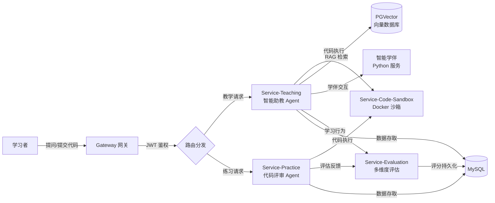
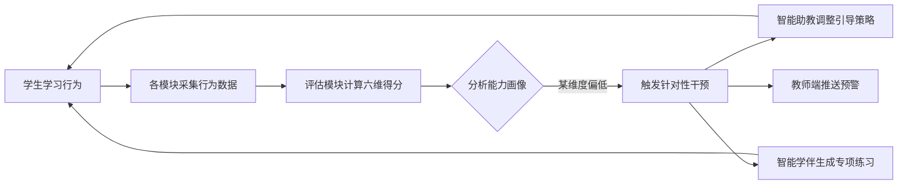

# 基于 Agent 的智能编程教育系统——项目报告

---

## 一、项目总体介绍

本项目为**基于 Agent 的智能编程教育系统**，旨在通过人工智能技术革新传统编程教学模式，构建以"智能助教 + 智能学伴 + 多维度评估"为核心的新型学习生态系统。系统突破传统编程工具"提问即答案"的被动响应模式，通过三大核心模块的协同作用，形成"引导—实践—反思"的闭环学习路径，助力学习者实现从知识习得到能力内化的进阶式成长。

### 1.1 技术栈概览

项目采用**前后端分离**架构，当前根目录下内容为**后端部分**，基于微服务思想构建。核心技术选型如下：

| 技术领域 | 技术选型 | 用途说明 |
|---------|---------|---------|
| 微服务框架 | Spring Cloud 2023.0.3 + Spring Boot 3.3.4 | 微服务基础架构，提供服务注册发现、配置管理等能力 |
| 服务治理 | Spring Cloud Alibaba 2023.0.3.2 + Nacos | 注册中心与配置中心，实现服务统一管理 |
| AI 框架 | LangChain4j 1.12.2 | 智能体（Agent）开发框架，支持 LLM 调用、RAG 检索增强生成、工具调用等 |
| 关系数据库 | MySQL | 核心业务数据存储，如用户信息、课程数据、练习记录等 |
| 向量数据库 | PGVector | 教学素材向量化存储，支持 RAG 语义检索 |
| 缓存 | Redis | 热点数据缓存与分布式会话管理 |
| 容器化 | Docker | 代码沙箱（go-judge）及智能学伴服务的容器化部署 |
| 编程语言 | Java 20 | 主后端开发语言 |
| 构建工具 | Maven | 项目构建与依赖管理 |

### 1.2 微服务模块总览

项目共包含**六个微服务模块**，各司其职、协同运作：

| 模块名称 | 目录位置 | 核心职责 |
|---------|---------|---------|
| **Gateway（网关模块）** | `gateway/` | 统一入口，负责身份认证、JWT 鉴权与请求路由转发 |
| **Service-User（用户管理模块）** | `services/service-user/` | 用户注册、登录、角色管理与信息维护 |
| **Service-Teaching（教学模块）** | `services/service-teaching/` | 教学资料管理、智能助教 Agent、智能学伴工具调用 |
| **Service-Practice（练习模块）** | `services/service-practice/` | 习题管理、代码提交与批改、AI 代码评审 |
| **Service-Evaluation（评估模块）** | `services/service-evaluation/` | 多维度学生能力评估，综合自动化与人工评审 |
| **Service-Code-Sandbox（代码沙箱模块）** | `services/service-code-sandbox/` | 代码安全隔离执行，通过 Docker 与 go-judge 通信 |

此外，项目还包含：
- **Entities（共用实体模块）**：`entities/` 目录，存放跨微服务共用的 POJO 类，避免重复定义。
- **Service-Agents（智能体模块）**：`services/service-agents/`，智能体相关配置与通用组件（开发中）。
- **Service-Analysis（分析模块）**：`services/service-analysis/`，代码分析逻辑（已集成至 service-practice）。

### 1.3 系统核心业务流程



---

## 二、项目架构介绍

### 2.1 整体架构设计

系统采用**微服务 + AI Agent** 的双层架构模式：

- **基础设施层**：以 Nacos 为注册中心和配置中心，Spring Cloud Gateway 为统一入口，实现服务的自动发现、负载均衡与请求路由。
- **业务服务层**：按照业务领域拆分为教学、练习、评估、用户管理、代码沙箱五个独立的微服务，各服务通过 OpenFeign 进行声明式 RPC 调用。
- **AI 智能层**：基于 LangChain4j 框架构建智能体（Agent），集成 LLM 大语言模型、RAG 检索增强生成、Function Calling 工具调用等能力，为教学和练习场景提供智能化支持。
- **数据存储层**：MySQL 存储结构化业务数据，PGVector 存储教学素材的向量化嵌入以支持语义检索，Redis 提供高性能缓存。

### 2.2 微服务通信机制

```
┌─────────────────────────────────────────────────────────┐
│                    Nacos 注册中心                         │
│   ┌──────────┐  ┌──────────┐  ┌──────────┐             │
│   │ Gateway  │  │Teaching  │  │Practice  │  ...        │
│   └────┬─────┘  └────┬─────┘  └────┬─────┘             │
└────────┼──────────────┼──────────────┼───────────────────┘
         │              │              │
         ▼              ▼              ▼
┌─────────────────────────────────────────────────────────┐
│              服务间通信（OpenFeign + REST）                │
│  • Practice/Teaching → Code-Sandbox（代码执行）           │
│  • Practice/Teaching → Evaluation（评估反馈）              │
│  • Teaching → SmartCompanion（学伴工具，HTTP 调用）        │
└─────────────────────────────────────────────────────────┘
```

- **外部请求**统一经 Gateway 网关进行 JWT 身份认证后，根据路由规则转发至对应的微服务。
- **内部服务间调用**使用 Spring Cloud OpenFeign，以声明式 HTTP 客户端简化远程调用逻辑。
- **AI 工具调用**（如代码沙箱执行、RAG 检索、智能学伴通信）通过 LangChain4j 的 `@Tool` 注解机制注册为 Agent 可调用的工具函数。

### 2.3 安全与鉴权

系统采用**JWT（JSON Web Token）**作为身份认证方案：
- 用户登录后，网关签发 JWT Token 返回前端。
- 后续请求须在 Header 中携带 Token，由 Gateway 的 `JwtAuthCheckFilter` 全局过滤器统一校验。
- 校验通过后，从 Token 中解析出 `userId` 和 `role` 注入请求头，转发给下游微服务使用，实现无状态认证。

---

## 三、各模块详细介绍

### 3.1 Entities（共用实体模块）

**目录位置**：`entities/`

该模块为跨微服务共用的 POJO 类库，避免各微服务重复定义相同的数据结构。主要包含：

| 包路径 | 用途 |
|--------|------|
| `com.hbwl.codesandbox.pojo` | 代码沙箱通用输入输出格式（`CodeSandboxInput`、`CodeSandboxOutput`），定义提交代码的元数据与执行结果 |
| `com.hbwl.analysis.pojo` | 代码分析数据结构（`AnalysisInput`、`AnalysisOutput`），包含题目、代码文本、输入输出及 AI 分析结果 |
| `com.hbwl.teaching.pojo` | 教学模块数据模型（`TeachingInput`），关联学生提问、代码片段及教学素材 ID |
| `com.hbwl.common` | 通用结果封装类 `Result`，用于统一 API 响应格式 |

通过 Maven 的 `<dependency>` 机制，各微服务模块在 `pom.xml` 中引入 `entities` 依赖即可共享这些数据结构，保证了系统内部数据格式的一致性。

---

### 3.2 Gateway（网关模块）

**目录位置**：`gateway/`

Gateway 作为系统的**统一入口**，承担两项核心职责：

#### 3.2.1 JWT 身份认证与鉴权

`gateway/src/main/java/com/hbwl/jwt/` 目录下实现了完整的 JWT 安全机制：

- **`JwtTokenUtil`**：负责 JWT Token 的生成、解析、过期校验及声明（Claims）提取。密钥配置于 `application.yaml` 中，支持 Token 的 TTL 动态配置。
- **`JwtAuthCheckFilter`**（全局过滤器）：拦截所有经过网关的请求，验证请求头中的 `Authorization` 字段。校验流程如下：
  1. 从请求头提取 `Bearer Token`；
  2. 调用 `JwtTokenUtil` 验证签名及有效期；
  3. 验证通过后，将 `userId` 和 `role` 注入请求头（如 `X-User-Id`、`X-User-Role`），转发给下游微服务；
  4. 验证失败则直接返回 `401 Unauthorized`。

此设计实现了**无状态认证**——下游微服务无需重复校验 Token，直接信任网关传递的用户身份信息即可。

#### 3.2.2 请求路由转发

`gateway/src/main/resources/application-route.yaml` 定义了完整的路由规则表，通过 Spring Cloud Gateway 的谓词（Predicate）与过滤器（Filter）机制，将不同路径前缀的请求分发至对应的微服务：

| 路径前缀 | 目标服务 |
|---------|---------|
| `/api/user/**` | service-user |
| `/api/teaching/**` | service-teaching |
| `/api/practice/**` | service-practice |
| `/api/evaluation/**` | service-evaluation |
| `/api/codesandbox/**` | service-code-sandbox |
| `/api/analysis/**` | service-analysis |

---

### 3.3 Service-Code-Sandbox（代码沙箱模块）

**目录位置**：`services/service-code-sandbox/`

该模块负责**安全地隔离执行用户提交的代码**，是系统中 AI Agent 进行代码分析的关键基础设施。

#### 3.3.1 对外接口

- **Controller**：`CodeSandboxController` 暴露 `POST /api/codesandbox/execute` 端点，接收包含代码文本、编程语言和输入数据的 `CodeSandboxInput` 请求。

#### 3.3.2 沙箱执行机制

- **`CodeExecutionTool`**：核心执行工具，通过 `RestTemplate` 与部署在 Docker 中的开源项目 **[go-judge](https://docs.goj.ac/cn/example)** （默认端口 `5050`）通信。
- **支持语言**：Java（`javac` 编译 + `java` 运行）、C++（`g++` 编译）、Python（直接解释执行）。
- **执行流程**：
  1. 将代码包装为 go-judge 要求的 JSON 格式请求体；
  2. 发送 HTTP 请求至 Docker 容器内的 go-judge 服务；
  3. go-judge 在隔离的文件系统和受限的资源配额（CPU、内存、时间）下执行代码；
  4. 返回包含标准输出、标准错误、执行时间、内存消耗和退出码的 `CodeSandboxOutput`。

#### 3.3.3 调用关系

以下模块通过 Feign 客户端调用本模块的代码执行接口：
- **service-practice**：运行学生提交的练习代码，获取执行结果用于判题；
- **service-teaching**：AI 助教 Agent 通过 `CodeSandboxTool` 工具调用，实时运行学生代码以诊断错误。

---

### 3.4 Service-Evaluation（评估模块）

**目录位置**：`services/service-evaluation/`

该模块负责从**多个维度综合评估**学生的学习表现，构建动态的能力画像，为个性化学习干预提供数据支撑。

#### 3.4.1 六大评估维度

评估维度定义于 `UserEvaluation.java`，具体如下：

| 维度名称 | 字段名 | 评分来源 | 含义 |
|---------|--------|---------|------|
| 代码准确率 | `accuracyRateScore` | 练习模块 | 衡量学生提交代码与标准答案的功能一致性 |
| AI 依赖度 | `aiDependenceScore` | 教学模块 | 衡量学生求助 AI 助教的频率，反映独立解决问题的能力 |
| 知识转化率 | `conversionEfficiencyScore` | 智能学伴 | 衡量学生将知识从理论学习迁移到实践应用的能力 |
| 表达能力 | `expressionScore` | 智能学伴 | 衡量学生在与学伴对话中展现的思维表达清晰度 |
| 知识掌握深度 | `masteryDepthScore` | 练习模块 | 衡量学生对编程概念的深层理解程度 |
| 代码质量 | `qualityScore` | 练习模块 | 综合衡量代码的可读性、结构性和规范性 |

#### 3.4.2 评分计算算法

- **分数更新**：采用**平滑移动平均**策略——$newScore = (latestScore + previousScore) / 2$，避免单次评估导致分数剧烈波动。
- **单项维度权重**：使用 `TestScoreUtil` 将 AI 返回的 0~5 分制通过系数 $INFACTOR=20$ 转换为百分制，并为不同维度配置差异化权重。例如：
  - 准确率：可读性 25% + 结构性 25% + 模块化 25% + 规范 25%；
  - 代码质量：可读性 40% + 规范 40% + 结构性 10% + 模块化 10%。
- **总分计算**：采用**均方根（RMS）**算法综合六大维度得分：

$$TotalScore = \sqrt{\frac{\sum_{i=1}^{6} Score_i^2}{6}}$$

该算法相比算术平均，更能凸显学生在某些维度的显著优势或短板。

#### 3.4.3 数据实体与转换

- **`UserScore`**（持久化实体）：`eachScore` 字段以 JSON 序列化字符串存储全部维度得分，持久化于 MySQL。
- **`UserEvaluation`**（业务对象）：用于实时展示和前端通信，由 `UserScore` 通过 Service 层转换而来。
- **初始化**：新用户注册时自动创建 `UserScore` 记录，各维度初始值设为 60 分（及格线）。

#### 3.4.4 评估触发点

- **`evaluateBaseOnPractice`**：练习模块调用，基于 AI 代码评审结果更新准确率、掌握深度、代码质量。
- **`evaluateBaseOnAITeaching`**：教学模块调用，基于 AI 助教调用频次更新 AI 依赖度。
- **`evaluateBaseOnSmartCompanion`**：智能学伴调用，基于对话质量反馈更新表达能力与转化率。

---

### 3.5 Service-Practice（练习模块）

**目录位置**：`services/service-practice/`

该模块负责管理编程练习题及学生作答流程，并集成**AI 代码评审 Agent**实现自动化判题与反馈。

#### 3.5.1 业务功能

- **练习管理**：`QuestionController` 和 `PracticeController` 提供课程的习题 CRUD、练习任务分发等接口。
- **答案提交与批改**：`UserAnswerServiceImpl` 管理学生提交的代码答案，支持教师人工批改与 AI 自动评审。
- **答案对比**：通过读取预置的标准输入/输出资源文件，将沙箱执行结果与预期输出对比，生成客观得分。

#### 3.5.2 AI 代码评审 Agent

评审 Agent 位于 `com.hbwl.ai` 包下，采用**双层 Agent 协作**架构：

**第一层：代码分析 Agent（`AICodeAnalyzerService`）**
- 角色定位：资深编程导师
- Prompt 定义于 `analyzer-system-prompt.txt`
- 从四个子维度评估代码：
  1. **可读性**：命名规范、注释完整性、代码格式
  2. **结构性**：逻辑组织清晰度、函数拆分合理性
  3. **模块化**：职责分离程度、代码复用性
  4. **解题规范**：是否符合题目要求、是否采用合理算法

**第二层：代码评审 Agent（`AICodeEvaluatorService`）**
- 作为顶层协调者，通过 `ModelConfig.java` 配置构建
- 注册的工具（Tools）包括：
  - `CodeSandboxTool`：调用代码沙箱执行用户代码并获取运行结果；
  - `AICodeAnalyzerService.analyze()`：将代码分析 Agent 注册为可调用工具，实现内部 Agent 协作。
- 综合代码文本、题目描述、沙箱执行结果和分析 Agent 的评估，生成包含**评语（Comment）**和**JSON 格式评分**的完整评价。

#### 3.5.3 判题流程

1. 获取题目的标准输入/输出资源文件；
2. 通过 `CodeSandboxFeignClient` 将用户代码提交至代码沙箱执行；
3. 调用 `CodeEvaluatorService.analyze`，AI 综合代码、题目和运行结果生成评价；
4. `AnalysisParseTool` 利用正则表达式从 AI 返回文本中提取结构化 JSON 评分；
5. 将沙箱输出与标准答案对比，综合 AI 评分得出最终分数；
6. 调用评估模块的 `evaluateBaseOnPractice` 接口同步分数，更新学生能力画像。

---

### 3.6 Service-Teaching（教学模块）

**目录位置**：`services/service-teaching/`

该模块是项目的**核心教学引擎**，集成了智能助教 Agent、RAG 检索增强生成和智能学伴通信工具三大智能化能力。

#### 3.6.1 教学资料与课程管理

- 支持教学资料（课件 PDF、视频等）的上传、存储与管理。
- 上传的资源经向量化处理后存入 PGVector 向量数据库，为 RAG 检索提供知识库基础。
- 课程信息管理与教学资源的关联维护。

#### 3.6.2 智能助教 Agent

智能助教 Agent 是本模块的核心亮点，基于 LangChain4j 构建，定义于 `AITeacherService.java` 接口并通过 `AITeacherServiceImpl` 实现。

**Agent 配置（`ModelConfig.java`）**：
- 使用 `AiServices.builder` 流式构建，集成以下组件：
  - **`StreamingChatModel`**：支持流式输出，提升交互实时性
  - **`AITeacherChatMemoryStore`**：将对话历史持久化至 MySQL 的 `agent_chat_memory` 表，支持跨会话记忆
  - **`PgVectorEmbeddingStore` + `EmbeddingStoreContentRetriever`**：实现基于 PGVector 的 RAG 检索，支持通过 `materialId` 动态过滤检索范围
  - **业务工具**：注册 `CodeSandboxTool` 等工具供 Agent 按需调用

**Prompts 体系**：采用**两层 Prompt** 架构，由 `RuntimePromptManager` 动态管理：
1. **基础 Prompt**（`base-prompt.txt`）：定义智能助教身份、核心职责（解答、分析、启发）和硬性规则（教学优先、禁止直接给出完整代码答案、安全合规）；
2. **格式 Prompt**（`default-prompt.txt`）：规定结构化响应格式，要求输出必须包含 `### 问题分析`、`### 解决方案` 等标记标题，并采用**分步引导法**逐步启发学生思考。

**Prompt 动态管理**：`PromptServiceImpl` 支持管理员在后台增删改查 Prompt 模板，并能即时热更新 AI Agent 当前使用的运行时版本，无需重启服务。

**对外接口**（`TeachingController`）：
- `POST /api/teaching/ai/teach`：AI 代码教学，接收学生代码及问题，以 `Flux<String>` 流式返回引导性解答；
- `POST /api/teaching/ai/answer`：AI 知识问答，回答编程概念、语法等通用问题。

**Agent 注册工具**：
- **`CodeSandboxTool`**：将代码沙箱能力封装为 Agent 可调用的 `@Tool` 函数，AI 可主动运行学生代码以诊断问题；
- **RAG 检索器**：作为 Agent 的内部知识库，自动检索相关教学素材辅助回答。

#### 3.6.3 智能学伴工具

`SmartCompanionTool.java` 是本模块与智能学伴（Python 服务）之间的**桥梁工具**：

- **通信方式**：通过 `RestTemplate` 调用部署在本地的 Python 服务（`http://localhost:8000`）；
- **核心接口**：
  - `POST /api/v1/sessions`：创建/清空对话会话，绑定 `userId`；
  - `POST /api/v1/chat`：发起对话交互，传递学生消息并接收智能学伴回复；
  - `GET /api/v1/sessions/{id}/status`：查询会话状态。
- **评分反馈**：`SmartCompanionServiceImpl` 在对话结束时，自动将智能学伴返回的 `expressionScore`（表达分）和 `conversionEfficiencyScore`（转化效率分）通过 Feign 客户端同步至评估模块。

#### 3.6.4 调用限制

系统配置了 `agent.max-call-per-hour` 参数（默认 100 次/小时），对学生调用 AI 助教的频率进行合理限制，引导学生培养独立解决问题的能力，而非过度依赖 AI。

---

### 3.7 Service-User（用户管理模块）

**目录位置**：`services/service-user/`

该模块负责系统用户的**全生命周期管理**，基于 MyBatis-Plus 实现数据持久化。

**核心功能**：
- **用户注册**：支持学生、教师和管理员三种角色的注册；
- **用户登录**：基于 JWT 的登录认证，登录成功后网关签发 Token；
- **用户 CRUD**：用户信息的增删改查，`UserServiceImpl` 封装了 MyBatis-Plus 的数据操作逻辑；
- **角色管理**：区分学生、教师、管理员角色，不同角色拥有不同的系统权限。

---

## 四、创新点介绍

本项目围绕编程教育的核心痛点——"如何让学生真正学会编程，而非仅仅获得答案"——提出了三大创新设计，形成"引导—实践—反思"的完整学习闭环。

---

### 4.1 创新点一：智能助教——启发式交互设计

传统编程辅助工具（如通用 AI 对话）往往直接给出完整代码答案，学生复制粘贴即完成任务，缺乏深度思考过程，导致"一看就会，一写就废"的困境。本项目的智能助教模块从根本上改变了这一模式。

#### 4.1.1 核心设计理念

智能助教采用**启发式交互设计**，核心理念可概括为：

> "不授人以鱼，而授人以渔；不给答案，给思路。"

Agent 被明确禁止直接提供完整代码解决方案，而是通过**概念溯源、逻辑拆解和渐进式提示**三条路径，引导学生自主构建问题解决框架。

#### 4.1.2 三层引导策略

```
┌─────────────────────────────────────────────────────┐
│                 智能助教引导层次                        │
├─────────────────────────────────────────────────────┤
│  第一层：概念溯源                                     │
│  • 定位学生困惑的知识点源头                            │
│  • 关联相关的基础概念和原理                            │
│  • "你的问题本质上是关于 XX 概念的理解……"               │
├─────────────────────────────────────────────────────┤
│  第二层：逻辑拆解                                     │
│  • 将复杂问题分解为可管理的子问题                       │
│  • 梳理解题步骤和逻辑链条                             │
│  • "我们可以把这个问题拆成三步：首先……其次……最后……"     │
├─────────────────────────────────────────────────────┤
│  第三层：渐进式提示                                   │
│  • 根据学生反应动态调整提示粒度                        │
│  • 从模糊方向 → 具体线索 → 关键代码片段                │
│  • 确保学生有充分的独立思考空间                        │
└─────────────────────────────────────────────────────┘
```

#### 4.1.3 技术实现支撑

- **结构化 Prompt 体系**：`base-prompt.txt` 与 `default-prompt.txt` 两层 Prompt 精确定义了启发式教学的行为边界，要求输出必须包含 `### 问题分析` 和 `### 解决方案` 等结构化标记；
- **RAG 检索增强**：通过 PGVector 向量数据库检索相关教学素材，确保助教的引导内容与课程知识体系一致，做到"概念溯源"有据可依；
- **代码沙箱实时诊断**：Agent 可主动调用 `CodeSandboxTool` 运行学生代码，基于实际运行结果（而非猜测）给出针对性引导；
- **Prompt 热更新**：管理员可通过 `PromptServiceImpl` 实时调整引导策略，无需重启服务即可优化教学效果；
- **流式输出**：采用 `StreamingChatModel` + `Flux<String>` 流式返回，模拟真人教师逐句引导的交互体验，避免大段文字"轰炸"。

---

### 4.2 创新点二：智能学伴——认知学徒制

如果说智能助教是"站在讲台上的老师"，智能学伴则是"坐在身边的同学"。智能学伴系统创新性地引入**认知学徒制（Cognitive Apprenticeship）**理论，通过模拟同伴学习场景激发学生的深度思考。

#### 4.2.1 核心设计理念

认知学徒制强调学习应发生在真实的问题情境中，通过**观察—模仿—实践—反思**的循环逐步内化知识与技能。智能学伴将这一理论转化为三个核心机制：

1. **基于动态知识图谱的错误案例生成**：学伴系统根据学生当前的学习阶段和知识薄弱点，动态生成包含**典型认知偏差**的错误代码案例，让学生在"找茬"过程中加深理解；
2. **进阶式挑战问题设计**：根据学生能力画像（由评估模块提供），自动匹配难度递进的问题序列，始终保持"最近发展区"的挑战水平；
3. **自适应反馈机制**：根据学生的回答质量和对话表现，动态调整反馈策略——从直接指正到暗示引导，再到开放式追问。

#### 4.2.2 技术实现支撑

- **异构语言协作**：智能学伴核心 AI 逻辑部署在独立的 **Python 服务**（`http://localhost:8000`）中，与 Java 后端通过 REST API 松耦合通信。Python 生态在 AI/ML 领域的丰富库支持（如知识图谱构建、自然语言处理）为学伴的智能行为提供了更灵活的技术基础；
- **`SmartCompanionTool` 桥接**：Java 端通过该工具类封装了学伴服务的会话管理（`/api/v1/sessions`）和对话交互（`/api/v1/chat`）接口；
- **会话状态管理**：学伴服务维护每个学生的独立会话上下文，支持长期对话记忆和上下文感知；
- **双向评分反馈**：对话结束时，学伴服务返回 `expressionScore`（表达分）和 `conversionEfficiencyScore`（转化效率分），通过 `SmartCompanionServiceImpl` 自动同步至评估模块，形成学伴互动→能力画像更新的闭环。

#### 4.2.3 与智能助教的协同分工

| 维度 | 智能助教（AI Teacher） | 智能学伴（Smart Companion） |
|------|----------------------|---------------------------|
| 角色定位 | 权威导师 | 同伴学习者 |
| 交互模式 | 讲解、引导、分析 | 对话、挑战、追问 |
| 知识方向 | 从概念到实践（Top-down） | 从问题到反思（Bottom-up） |
| 反馈风格 | 结构化、系统性 | 互动式、启发式 |
| 评分维度 | AI 依赖度 | 表达能力、知识转化率 |

---

### 4.3 创新点三：多维度评价体系——立体式能力画像

传统编程教育评价往往仅以"代码是否能运行并通过测试用例"为唯一标准，忽略了代码质量、学习态度、思维过程等关键维度。本项目构建的多维度评价体系，整合**自动化评测与人工评审**的优势，形成覆盖代码功能、代码质量及学习过程的**立体评价框架**。

#### 4.3.1 六大评价维度

```
                      ┌──────────────┐
                      │   知识掌握深度  │
                      │  (练习模块)    │
                      └──────┬───────┘
                             │
        ┌────────────────────┼────────────────────┐
        │                    │                    │
        ▼                    ▼                    ▼
┌──────────────┐    ┌──────────────┐    ┌──────────────┐
│   代码准确率   │    │   代码质量    │    │  AI 依赖度   │
│  (沙箱判题)   │    │ (AI 多维分析) │    │ (调用频率)   │
└──────────────┘    └──────────────┘    └──────────────┘
        │                    │                    │
        └────────────────────┼────────────────────┘
                             │
                    ┌────────┴────────┐
                    │                 │
                    ▼                 ▼
            ┌──────────────┐  ┌──────────────┐
            │   表达能力    │  │  知识转化率   │
            │  (学伴对话)   │  │  (学伴对话)   │
            └──────────────┘  └──────────────┘
```

维度设计的核心思想是**从多个角度还原学生的真实能力**：
- **代码功能维度**（准确率）：客观衡量，通过沙箱执行结果与标准答案对比得出；
- **代码质量维度**（代码质量、知识深度）：主观+AI 评估，由 AI 评审 Agent 从可读性、结构性、模块化、规范性四个子维度综合给出；
- **学习过程维度**（AI 依赖度、表达能力、知识转化率）：过程性评价，追踪学生的学习行为模式而非一次性考试结果。

#### 4.3.2 核心算法创新

**加权平滑移动平均**避免分数剧烈波动：

$$Score_{new} = \frac{Score_{latest} + Score_{previous}}{2}$$

**均方根（RMS）总分计算**凸显能力长短板：

$$TotalScore = \sqrt{\frac{1}{6}\sum_{i=1}^{6} Score_i^2}$$

相较于算术平均，RMS 对极端值更敏感——学生在某个维度的突出表现或明显短板都会被总分更显著地反映，从而为个性化教学干预提供更精准的依据。

#### 4.3.3 个性化学习干预闭环

多维度评估体系不仅是一个"打分工具"，更是驱动个性化学习干预的**数据引擎**：



例如：
- 若 **AI 依赖度** 偏高 → 智能助教降低提示粒度，鼓励独立思考；
- 若 **代码质量** 偏低 → 智能学伴生成更多代码审查类练习；
- 若 **表达能力** 偏低 → 学伴增加开放式追问，引导更详细的技术表达。

---

## 五、总结与展望

本项目以 SpringCloud 微服务架构为底座，以 LangChain4j AI 框架为核心驱动，构建了一个集**智能助教、智能学伴、多维度评估**于一体的新型编程教育系统。三大创新点协同作用，形成了"引导（助教启发）→ 实践（学伴挑战 + 沙箱练习）→ 反思（多维评估反馈）"的完整学习闭环。

项目在以下方面具有进一步的发展潜力：
- **知识图谱深化**：构建更细粒度的编程知识图谱，提升错误案例生成的精准度和个性化程度；
- **多模态交互**：引入语音、视频等交互方式，降低编程学习门槛；
- **学习路径自适应**：基于长期能力画像数据，自动规划个性化的学习路径和课程推荐；
- **协作学习**：支持多人协作编程场景，引入团队协作能力的评估维度。


