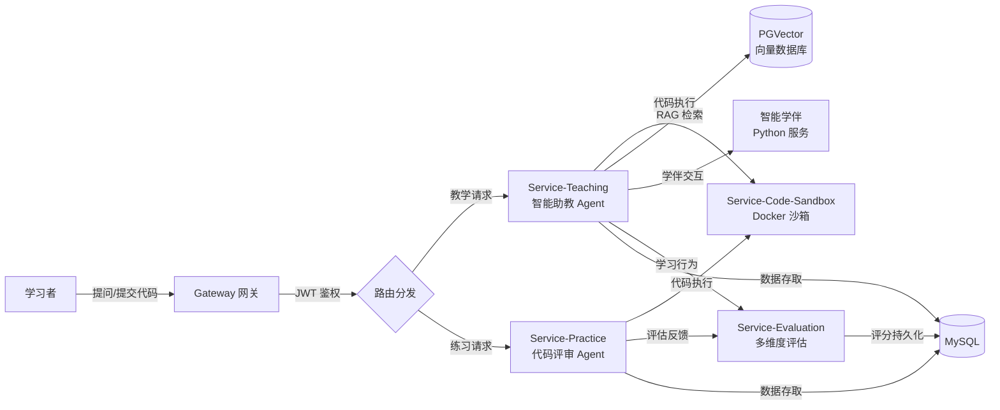

# 慧编未来 —— 基于 Agent 的智能编程教育系统

---

## 一、项目总体介绍

**慧编未来**（Smart Programming Education Platform）是一个基于 **AI Agent** 的智能编程教育系统，旨在通过人工智能技术革新传统编程教学模式，构建以"**智能助教 + 智能学伴 + 多维度评估**"为核心的新型学习生态系统。

系统突破传统编程工具"提问即答案"的被动响应模式，通过三大核心模块的协同作用，形成"**引导—实践—反思**"的闭环学习路径，助力学习者实现从知识习得到能力内化的进阶式成长。

### 1.1 用户角色

| 角色 | 功能描述 |
|------|---------|
| **学生（Student）** | 参与课程学习、完成编程练习、与 AI 学伴互动、查看个人学习画像 |
| **教师（Teacher）** | 管理课程与章节、发布练习与考试、配置 AI 提示词、编辑知识图谱 |
| **管理员（Admin）** | 用户管理与权限配置 |

### 1.2 核心功能

| 功能模块 | 描述 |
|---------|------|
| **课程学习系统** | 课程章节浏览、课程系列学习、视频/PDF 资料播放 |
| **智能 AI 助教** | 基于流式响应的 AI 问答，支持代码分享与 RAG 检索增强生成 |
| **AI 智能学伴** | 引导式对话学习，通过会话管理实现个性化教学交互 |
| **编程练习系统** | 在线编程题目练习，支持 C++/Python/Java 代码沙箱与自动判题 |
| **知识图谱** | 可视化知识节点与关系网络，支持节点导入/导出与资料关联 |
| **学习画像** | 学习进度追踪、学习时长统计、成就系统与学习能力评估 |
| **教师工作站** | 课程管理、练习管理、提示词配置、用户管理的统一入口 |

### 1.3 技术栈概览

项目采用**前后端分离**架构：

| 层级 | 技术领域 | 技术选型 |
|------|---------|---------|
| **后端** | 微服务框架 | Spring Cloud 2023.0.3 + Spring Boot 3.3.4 |
| | 服务治理 | Spring Cloud Alibaba 2023.0.3.2 + Nacos |
| | AI 框架 | LangChain4j 1.12.2（Agent 开发、RAG、工具调用） |
| | 关系数据库 | MySQL |
| | 向量数据库 | PGVector（教学素材向量化存储与语义检索） |
| | 缓存 | Redis |
| | 容器化 | Docker（go-judge 沙箱、智能学伴服务） |
| | 编程语言 | Java 20 |
| | 构建工具 | Maven |
| **前端** | 前端框架 | Vue 3（Composition API） |
| | 构建工具 | Vite |
| | 状态管理 | Pinia（持久化插件） |
| | UI 组件库 | Element Plus |
| | CSS 框架 | Tailwind CSS + SCSS |
| | 数据可视化 | ECharts |
| | 代码高亮 | Highlight.js |
| | Markdown 渲染 | Marked |
| | HTTP 客户端 | Axios |

### 1.4 微服务模块总览

| 模块名称 | 目录位置 | 核心职责 |
|---------|---------|---------|
| **Gateway（网关）** | `HBWL-demo/gateway/` | 统一入口，JWT 鉴权与请求路由转发 |
| **Service-User（用户管理）** | `HBWL-demo/services/service-user/` | 用户注册、登录、角色管理与信息维护 |
| **Service-Teaching（教学模块）** | `HBWL-demo/services/service-teaching/` | 教学资料管理、智能助教 Agent、智能学伴工具调用 |
| **Service-Practice（练习模块）** | `HBWL-demo/services/service-practice/` | 习题管理、代码提交与批改、AI 代码评审 |
| **Service-Evaluation（评估模块）** | `HBWL-demo/services/service-evaluation/` | 多维度学生能力评估，综合自动化与人工评审 |
| **Service-Code-Sandbox（沙箱）** | `HBWL-demo/services/service-code-sandbox/` | 代码安全隔离执行，Docker + go-judge |
| **Entities（共用实体）** | `HBWL-demo/entities/` | 跨微服务共用 POJO 类 |
| **前端应用** | `frontend/demo-01/` | Vue 3 单页应用，面向学生/教师/管理员 |

---

## 二、如何开始

### 2.1 环境要求

- **JDK**：20+
- **Node.js**：18+
- **Maven**：3.8+
- **Docker**：20.10+

### 2.2 Docker 镜像准备

启动以下容器（可使用 Docker Compose 或手动运行）：

| 镜像 | 版本 | 说明 |
|------|------|------|
| `go-judge` | 最新 | 开源代码沙箱，从 [go-judge](https://github.com/criyle/go-judge) 拉取或将 `docker/CodeSandbox/Dockerfile` 打包为镜像 |
| `pgvector/pgvector` | pg16 | PostgreSQL + PGVector 扩展，**对外暴露 5433 端口** |
| `redis` | 7.2.10 | 缓存服务 |
| `nacos/nacos-server` | v2.4.3 | 注册中心与配置中心 |
| `SmartCompanion` | — | 智能学伴 Python 服务，将 `docker/SmartCompanion/` 打包为 Docker 镜像 |

### 2.3 LLM 配置

#### Nacos 配置中心

Nacos 容器启动后，访问 `http://localhost:8848/nacos`，在配置列表中新增 `service-analysis.yaml`：

```yaml
llm:
  base-url:          # LLM API 地址
  api-key:           # API 密钥
  model-name:        # 模型名称
  stream-base-url:   # 流式输出 API 地址
  stream-model-name: # 流式模型名称
  embed-base-url:    # 嵌入模型 API 地址
  embed-model-name:  # 嵌入模型名称
```

#### 智能学伴配置

在 `docker/SmartCompanion/` 目录下的 `.env` 文件中填写相应的 LLM 配置。

### 2.4 数据库初始化

依次运行 `sql/` 目录下的所有 SQL 文件：
- `user.sql` — 用户管理相关表
- `teaching.sql` — 教学模块相关表
- `practice.sql` — 练习模块相关表
- `evaluation.sql` — 评估模块相关表

### 2.5 启动项目

#### 启动后端服务

按以下顺序启动各微服务模块：

```bash
# 1. 启动 Nacos（已在 Docker 中运行）

# 2. 启动网关
cd HBWL-demo/gateway
mvn spring-boot:run

# 3. 依次启动各业务服务
cd HBWL-demo/services/service-user
mvn spring-boot:run

cd HBWL-demo/services/service-code-sandbox
mvn spring-boot:run

cd HBWL-demo/services/service-evaluation
mvn spring-boot:run

cd HBWL-demo/services/service-practice
mvn spring-boot:run

cd HBWL-demo/services/service-teaching
mvn spring-boot:run
```

#### 启动前端应用

```bash
cd frontend/demo-01
npm install
npm run dev
```

前端开发服务器默认运行在 `http://localhost:5173`。

---

## 三、项目架构介绍

### 3.1 整体架构

系统采用**微服务 + AI Agent** 的双层架构模式：

```
┌────────────────────────────────────────────────────────────┐
│                    前端应用层（Vue 3 + Vite）                 │
│   ┌──────────┐  ┌──────────┐  ┌──────────┐               │
│   │  学生端   │  │  教师端   │  │  管理端   │               │
│   └────┬─────┘  └────┬─────┘  └────┬─────┘               │
└────────┼──────────────┼──────────────┼─────────────────────┘
         │              │              │
         ▼              ▼              ▼
┌────────────────────────────────────────────────────────────┐
│                 Gateway 网关（JWT 鉴权 + 路由转发）           │
└────────────────────────┬───────────────────────────────────┘
                         │
         ┌───────────────┼───────────────┐
         │               │               │
         ▼               ▼               ▼
┌─────────────┐  ┌─────────────┐  ┌─────────────┐
│ Service-    │  │ Service-    │  │ Service-    │
│ Teaching    │  │ Practice    │  │ Evaluation  │
│ (智能助教)   │  │ (代码评审)   │  │ (多维评估)   │
└──────┬──────┘  └──────┬──────┘  └──────┬──────┘
       │                │                │
       │          ┌─────┴─────┐          │
       │          │           │          │
       ▼          ▼           ▼          ▼
┌──────────┐ ┌──────────┐ ┌──────┐ ┌──────────┐
│ Code-    │ │ Smart    │ │MySQL │ │ PGVector │
│ Sandbox  │ │Companion │ │      │ │  + Redis │
│(go-judge)│ │(Python)  │ │      │ │          │
└──────────┘ └──────────┘ └──────┘ └──────────┘
```

### 3.2 后端微服务通信

- **外部请求**：统一经 Gateway 网关进行 JWT 身份认证后转发至对应微服务
- **内部服务间调用**：使用 Spring Cloud OpenFeign 声明式 HTTP 调用
- **AI 工具调用**：通过 LangChain4j `@Tool` 注解注册为 Agent 可调用的工具函数
- **服务注册发现**：所有服务注册至 Nacos，实现自动发现与负载均衡

### 3.3 前端架构

前端采用 **Views → Components → Store → API** 的分层架构：

- **Views 视图层**：页面级组件，负责页面整体布局与业务编排
- **Components 组件层**：可复用组件（AI 助教、代码沙箱、知识图谱等）
- **Store 状态管理**：基于 Pinia 的响应式状态管理，支持持久化
- **API 层**：Axios 实例 + 拦截器，统一处理 JWT 认证与错误处理

路由采用 **Hash 模式**，结合路由守卫实现学生、教师、管理员三级权限控制。

### 3.4 核心业务流程



---

## 四、创新点介绍

### 4.1 创新点一：智能助教 —— 启发式交互设计

传统编程辅助工具往往直接给出完整代码答案，学生复制粘贴即完成任务，缺乏深度思考过程。本项目的智能助教从根本上改变了这一模式。

**核心理念**："不授人以鱼，而授人以渔；不给答案，给思路。"

**三层引导策略**：

| 层次 | 策略 | 示例 |
|------|------|------|
| 第一层：概念溯源 | 定位学生困惑的知识点源头，关联基础概念 | "你的问题本质上是关于 XX 概念的理解……" |
| 第二层：逻辑拆解 | 将复杂问题分解为可管理的子问题 | "我们可以把这个问题拆成三步：首先……其次……最后……" |
| 第三层：渐进式提示 | 根据学生反应动态调整提示粒度 | 从模糊方向 → 具体线索 → 关键代码片段 |

**技术支撑**：
- **结构化 Prompt 体系**：两层 Prompt 精确定义启发式教学的行为边界
- **RAG 检索增强**：通过 PGVector 检索相关教学素材，确保引导内容与课程一致
- **代码沙箱实时诊断**：Agent 可主动运行学生代码，基于实际结果给出针对性引导
- **流式输出**：`StreamingChatModel` + `Flux<String>` 模拟真人教师逐句引导的交互体验
- **调用频率限制**：配置每小时最大调用次数，引导学生培养独立解决问题的能力

---

### 4.2 创新点二：智能学伴 —— 认知学徒制

智能学伴创新性地引入**认知学徒制（Cognitive Apprenticeship）**理论，通过模拟同伴学习场景激发学生的深度思考。

**三个核心机制**：

1. **基于动态知识图谱的错误案例生成**：根据学生当前学习阶段和知识薄弱点，动态生成包含典型认知偏差的错误代码案例，让学生在"找茬"中加深理解
2. **进阶式挑战问题设计**：根据学生能力画像，自动匹配难度递进的问题序列，始终保持"最近发展区"的挑战水平
3. **自适应反馈机制**：根据学生的回答质量和对话表现，动态调整反馈策略——从直接指正到暗示引导，再到开放式追问

**智能助教与智能学伴的协同分工**：

| 维度 | 智能助教（AI Teacher） | 智能学伴（Smart Companion） |
|------|----------------------|---------------------------|
| 角色定位 | 权威导师 | 同伴学习者 |
| 交互模式 | 讲解、引导、分析 | 对话、挑战、追问 |
| 知识方向 | 从概念到实践（Top-down） | 从问题到反思（Bottom-up） |
| 反馈风格 | 结构化、系统性 | 互动式、启发式 |
| 评分维度 | AI 依赖度 | 表达能力、知识转化率 |

**技术实现**：智能学伴核心 AI 逻辑部署在独立 Python 服务中，与 Java 后端通过 REST API 松耦合通信，充分利用 Python 生态在 AI/ML 领域的丰富库支持。

---

### 4.3 创新点三：多维度评价体系 —— 立体式能力画像

传统编程教育评价往往仅以"代码能否运行"为唯一标准。本项目构建了覆盖代码功能、代码质量及学习过程的**六大维度立体评价框架**：

| 维度名称 | 评分来源 | 含义 |
|---------|---------|------|
| 代码准确率 | 练习模块（沙箱判题） | 代码与标准答案的功能一致性 |
| AI 依赖度 | 教学模块（调用频率） | 求助 AI 助教的频率，反映独立解决问题能力 |
| 知识转化率 | 智能学伴 | 将知识从理论学习迁移到实践应用的能力 |
| 表达能力 | 智能学伴 | 与学伴对话中展现的思维表达清晰度 |
| 知识掌握深度 | 练习模块（AI 评审） | 对编程概念的深层理解程度 |
| 代码质量 | 练习模块（AI 评审） | 代码的可读性、结构性和规范性 |

**核心算法**：

- **平滑移动平均**：$Score_{new} = \frac{Score_{latest} + Score_{previous}}{2}$，避免单次评估导致分数剧烈波动
- **均方根（RMS）总分**：$TotalScore = \sqrt{\frac{1}{6}\sum_{i=1}^{6} Score_i^2}$，相比算术平均更能凸显学生的优势与短板

**个性化干预闭环**：评估体系不仅是"打分工具"，更是驱动个性化学习的**数据引擎**——当某维度偏低时，系统自动触发针对性干预（如调整助教引导策略、生成专项练习、推送教师预警），形成持续改进的学习闭环。

---

## 五、项目目录结构

```
├── README.md                        # 项目说明文档
├── doc/                             # 项目文档与设计图
│   └── 智慧编程教学平台.excalidraw    # 架构设计图
├── docker/                          # Docker 相关配置
│   ├── CodeSandbox/                 # go-judge 代码沙箱镜像
│   │   └── Dockerfile
│   └── SmartCompanion/              # 智能学伴 Python 服务
│       ├── compose.yaml
│       ├── Dockerfile
│       ├── config.py
│       ├── main.py
│       ├── models.py
│       └── requirements.txt
├── sql/                             # 数据库初始化脚本
│   ├── user.sql
│   ├── teaching.sql
│   ├── practice.sql
│   └── evaluation.sql
├── frontend/                        # 前端项目
│   └── demo-01/                     # Vue 3 前端应用
│       ├── src/
│       │   ├── view/                # 页面视图
│       │   ├── components/          # 可复用组件
│       │   ├── router/              # 路由配置
│       │   ├── store/               # Pinia 状态管理
│       │   ├── api/                 # API 请求层
│       │   └── styles/              # 样式文件
│       └── ...
└── HBWL-demo/                       # 后端项目
    ├── pom.xml                      # 父 POM
    ├── entities/                    # 共用实体模块
    ├── gateway/                     # 网关模块
    └── services/                    # 微服务模块
        ├── service-user/            # 用户管理
        ├── service-teaching/        # 教学模块（智能助教）
        ├── service-practice/        # 练习模块（代码评审）
        ├── service-evaluation/      # 评估模块（多维评价）
        ├── service-code-sandbox/    # 代码沙箱
        ├── service-analysis/        # 代码分析
        └── service-agents/          # 智能体通用配置
```

---

## 六、相关文档

- [后端详细设计报告](HBWL-demo/report/report.md)
- [前端详细设计报告](frontend/report.md)