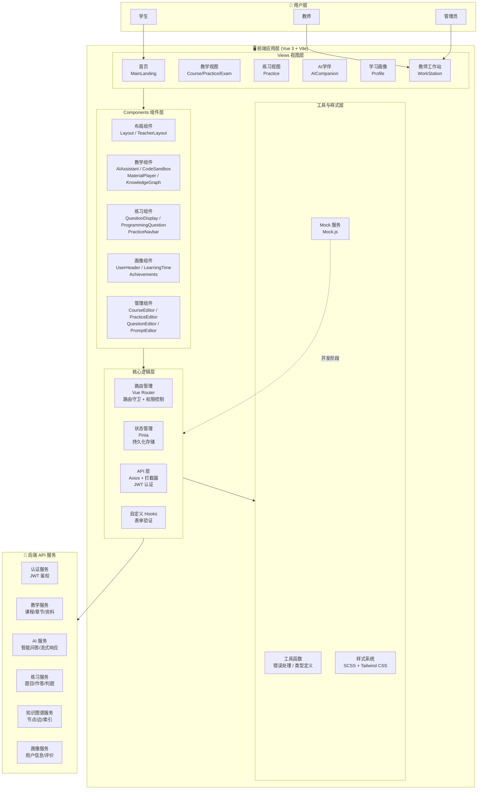
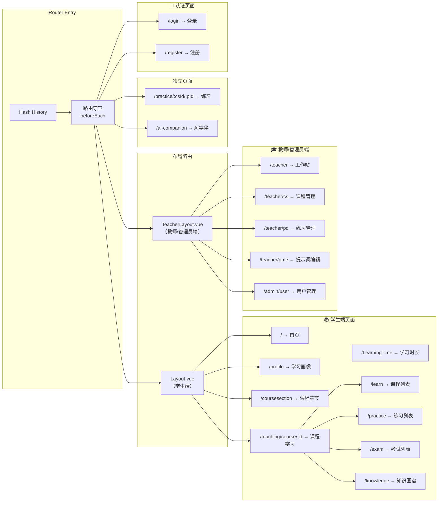
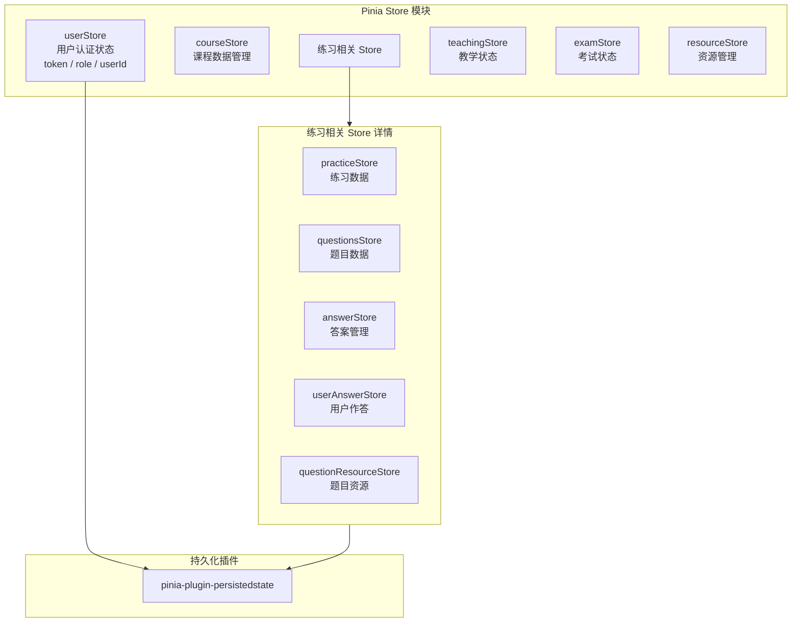
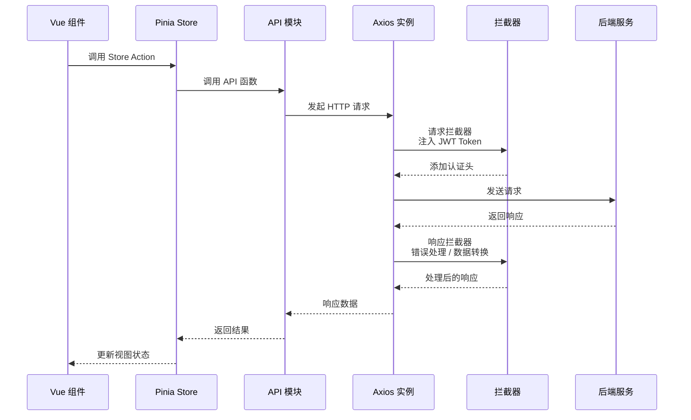
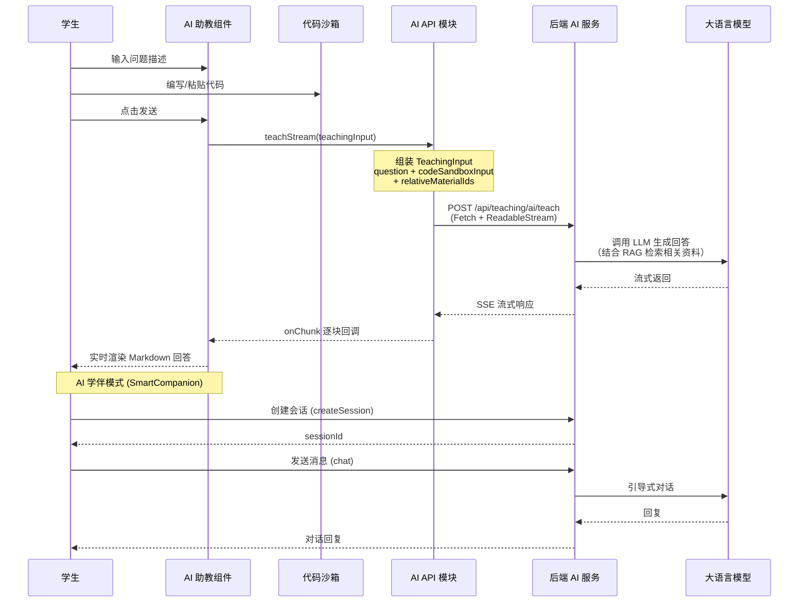

# 基于Agent的智能编程教育系统 —— 前端项目报告

---

## 一、项目总体介绍

### 1.1 项目概述

**慧编未来**（Smart Programming Education Platform）是一个基于 Agent 的智能编程教育系统，旨在为编程学习者提供智能化、个性化的学习体验。系统以 Vue 3 为核心前端框架，结合 AI 智能助教、知识图谱、代码沙箱等前沿技术，构建了一个集课程学习、编程练习、智能答疑、学习分析于一体的综合性编程教育平台。

平台面向三类用户角色：
- **学生（Student）**：参与课程学习、完成编程练习、与 AI 学伴互动、查看个人学习画像
- **教师（Teacher）**：管理课程与章节、发布练习与考试、配置 AI 提示词、编辑知识图谱
- **管理员（Admin）**：用户管理与权限配置

### 1.2 核心功能

| 功能模块 | 描述 |
|---------|------|
| **课程学习系统** | 课程章节浏览、课程系列学习、视频/PDF 资料播放 |
| **智能 AI 助教** | 基于流式响应的 AI 问答，支持代码分享与 RAG 检索增强生成 |
| **AI 智能学伴** | 引导式对话学习，通过会话管理实现个性化教学交互 |
| **编程练习系统** | 在线编程题目练习，支持 C++/Python/Java 代码沙箱与自动判题 |
| **知识图谱** | 可视化知识节点与关系网络，支持节点导入/导出与资料关联 |
| **学习画像** | 学习进度追踪、学习时长统计、成就系统与课程证书 |
| **教师工作站** | 课程管理、练习管理、提示词配置、用户管理的统一入口 |

### 1.3 技术栈

| 类别 | 技术 | 版本 |
|------|------|------|
| 前端框架 | Vue 3 (Composition API) | ^3.5.10 |
| 构建工具 | Vite | ^5.4.8 |
| 路由管理 | Vue Router (Hash 模式) | ^4.5.1 |
| 状态管理 | Pinia（持久化插件） | ^3.0.4 |
| UI 组件库 | Element Plus | ^2.11.2 |
| CSS 框架 | Tailwind CSS + SCSS | ^3.4.18 / ^1.97.0 |
| HTTP 客户端 | Axios | ^1.12.2 |
| 数据可视化 | ECharts | ^6.0.0 |
| 代码高亮 | Highlight.js | ^11.11.1 |
| Markdown 渲染 | Marked | ^16.3.0 |
| 视频播放 | Video.js | ^8.23.4 |
| PDF 查看 | vue3-pdf-app | ^1.0.3 |
| Mock 数据 | Mock.js + vite-plugin-mock | ^1.1.0 |
| 代码检查 | ESLint + eslint-plugin-vue | ^9.39.1 |

---

## 二、项目架构介绍

### 2.1 整体架构图



### 2.2 路由架构



### 2.3 状态管理架构（Pinia Store）



### 2.4 API 请求流程



### 2.5 AI 智能交互流程



### 2.6 目录结构概览

```
demo-01/
├── index.html                     # 入口 HTML
├── package.json                   # 依赖配置
├── vite.config.js                 # Vite 构建配置
├── tailwind.config.js             # Tailwind CSS 配置
├── postcss.config.js              # PostCSS 配置
├── eslint.config.js               # ESLint 配置
├── public/                        # 静态资源
└── src/
    ├── main.js                    # 应用入口（挂载 Vue、Pinia、Router、ElementPlus）
    ├── App.vue                    # 根组件
    ├── BlankTemplate.vue          # 空白模板
    ├── router/
    │   └── router.js              # 路由配置 + 路由守卫
    ├── store/
    │   ├── index.js               # Pinia 实例 + 统一导出
    │   └── modules/               # 各业务 Store 模块
    ├── api/
    │   ├── index.js               # API 统一导出
    │   ├── request.js             # Axios 实例 + 拦截器
    │   └── modules/               # 按业务分类的 API 模块
    ├── hooks/
    │   ├── index.js               # Hooks 统一导出
    │   └── common/                # 通用 Hooks
    ├── utils/
    │   ├── error.js               # 业务错误类
    │   └── types.js               # 类型定义 (JSDoc)
    ├── mock/
    │   ├── index.js               # Mock 统一导出
    │   ├── auth/                  # 认证 Mock
    │   └── practice/              # 练习 Mock
    ├── styles/
    │   ├── index.scss             # 全局样式入口
    │   └── modules/               # SCSS 模块（变量、重置）
    ├── view/                      # 页面视图
    │   ├── homepage/              # 首页
    │   ├── auth/                  # 登录/注册
    │   ├── teaching/              # 教学相关页面
    │   ├── practice/              # 练习页面
    │   ├── ai/                    # AI 学伴页面
    │   ├── teacher/               # 教师工作站
    │   └── test/                  # 测试页面
    ├── components/                # 可复用组件
    │   ├── Layout.vue             # 学生端布局
    │   ├── TeacherLayout.vue      # 教师端布局
    │   ├── homepage/              # 首页组件
    │   ├── teaching/              # 教学组件（AI助手、代码沙箱等）
    │   ├── practice/              # 练习组件
    │   ├── profiling/             # 画像组件
    │   └── admin/                 # 管理组件
    └── assets/                    # 静态资源
        ├── homepage/              # 首页图片
        ├── profile/               # 画像图片
        └── teaching/              # 教学图片
```

### 2.7 关键技术特点

1. **基于 Agent 的智能交互**：系统通过 AI 助教（AIAssistant）和 AI 学伴（SmartCompanion）两种模式，实现智能化的编程教学交互。AI 助教支持流式响应（SSE），可结合课程资料进行 RAG 检索增强生成；AI 学伴则通过会话管理实现引导式对话学习。

2. **多角色权限控制**：基于 JWT 的身份认证，结合路由守卫实现学生、教师、管理员三级权限管控，不同角色拥有不同的默认路由和功能入口。

3. **模块化架构设计**：采用 Views → Components → Store → API 的分层架构，各层职责清晰，组件可复用性强。API 层按业务模块（teaching、practice、auth、profiling）组织，便于维护和扩展。

4. **代码沙箱与在线判题**：集成 Highlight.js 实现的代码编辑器，支持 C++、Python、Java 三种语言的高亮显示，结合后端自动判题服务，实现即时的编程练习反馈。

5. **知识图谱可视化**：支持知识节点与边的 CRUD 操作，通过 ECharts 实现知识图谱的可视化展示，支持 Excel 批量导入导出，将知识点与教学资料进行关联索引。

6. **开发效率保障**：集成 Mock.js + vite-plugin-mock 实现前端独立开发，ESLint 保障代码质量，Pinia 持久化插件简化状态管理，Tailwind CSS + SCSS 提升样式开发效率。
